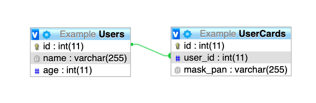

# Chomchob Backend Testing

Thank you for interest in ChomCHOB

We have 2 part for testing your coding skill.
When you done this task you need to created repository like in "example submission" folder on your github repository.

This test contain with __2 part.__

1. [Programming](#programming)
2. [Database](#database)

---

# Note
- You have 7 day after receive email to complete this test.

---

# Programming

  ### Simple Wallet Api

  **Description**
  
  You need to create simple wallet api for transfer cryptocurrency between user A to user B. Also have admin ability to manage both cryptocurrency and exchange rate.

  **Requirement**

  - Admin can increase and decrease user cryptocurrency balance.
  - Admin can see all total balance of all cryptocurrency.
  - Admin can add other cryptocurrency such XRP, EOS, XLM to wallet.
  - Admin can manage exchange rate between cryptocurrency.
  - User can transfer same cryptocurrency to other.
  > Example
  >
  > UserA transfer 10 ETH to UserB so UserB will recieve 10 ETH
  - User can transfer cryptocurrency to other with difference currency such ETH to BTC with exchange rate.
  > Example
  >
  > UserA transfer 1000 ETH to UserB with exchange rate ETH/BTC equal to 0.05 so UserB will recieve 50 BTC
  - It ok whether cryptocurrency have decimal or not.

  **Technical Detail**
  - This API need to be written with Nodejs.
  - You can use any nodejs web framework but we prefer [express](https://expressjs.com/).
  - You can use any tool or library to help you build API. 
  - Database we prefer mariadb, but if you think other database is suitable it fine to use that db.
  - Please provide us [POSTMAN](https://www.postman.com/) collection and environment(if needed) in JSON format.
  - This is **not** decentralized wallet so no need to worry about blockchain stuff.
  - If some of detail or requirement are ambiguous, we so sorry about that. And feel free to use your creative thinking to do that stuff.
  
  **Bonus**
  - TDD
  - Deploy to cloud such as aws or gcp.


---

# Database


You have assign to design Database for sale item code system for game
this provide for customer who want to buy code for using in game.

  **Detail**
  
  - Item for sale must have product name, product detail, sale price, open sale date, end sale date.
  - When customer already bought an item, customer will receive code (code can be created or create after bought).
  - item have a discount promotion period with specific date time for example normal price is 150 baht and have a promotion on January and set discounted price to 100 baht.

  **Bonus**

  - item may sale in bundle type for example sale two difference character skin set in special price or sale five gachapon box (for random item) in special price.

  **Objective**

  - Create database in form of model from [sequelize.](https://github.com/sequelize/sequelize)
  - Create Entity Relationship Diagram (ERD) and provide us with picture or pdf format. You can create ERD with any tool you want even handwriting is fine.
  - Please provide us description why you design database like this, for clearly understand.
  
  **Example Sequelize Model**

  ```js
  // Store User
  const User = sequelize.define('User', {
    id: Sequelize.INTEGER,
    name: Sequelize.STRING,
    age: Sequelize.INTEGER,
  })
  
  User.associate = (models) => {
    User.hasMany(UserCard, { foreignKey: 'user_id' })
  }

  // Store User credit card 
  const UserCard = sequelize.define('UserCard', {
    id: Sequelize.INTEGER,
    user_id: Sequelize.INTEGER,
    mask_pan: Sequelize.STRING,
  })

  UserCard.associate = (models) => {
    UserCard.belongsTo(User, { foreignKey: 'user_id' })
  }
  ```

  **Example Entity Relationship Diagram**

  

  
  **Hint**

  - You can see database part in [thai language](translate/THAI_DB.md) for better understanding.
